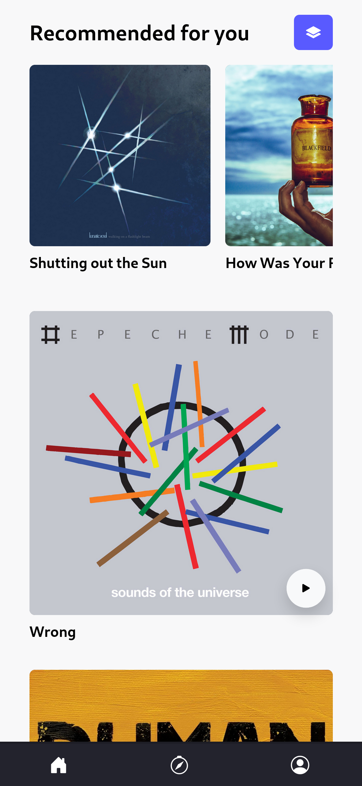
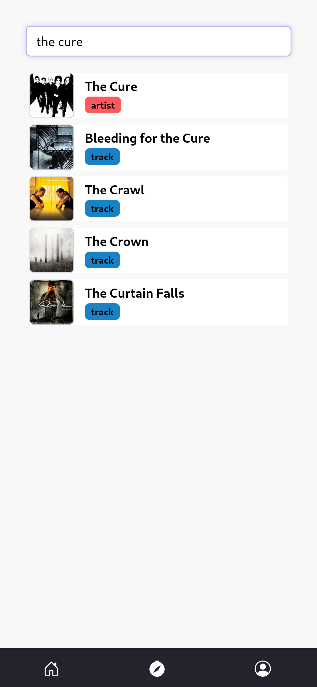
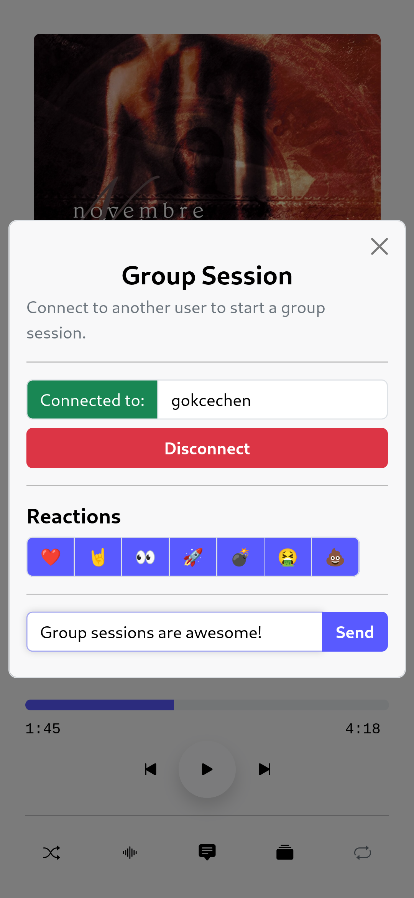
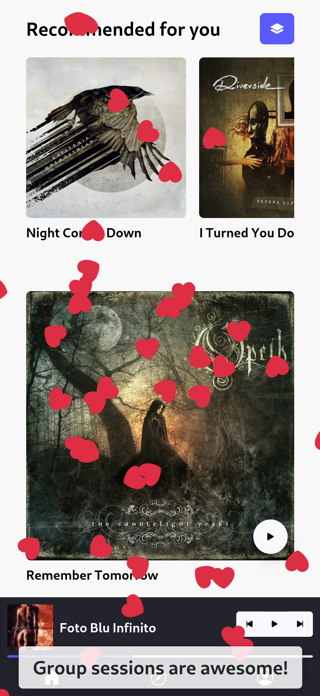

    
    <h1 align="center">Forte</h1>
    
    

        The Official Forte Android App
         
        

            
            
            
            
            
        

        <a href="https://github.com/kaangiray26/forte-app/issues">Report Bug</a>
        ·
        <a href="https://github.com/kaangiray26/forte-app/issues">Request Feature</a>
    

## Screenshots

## Where can I download the app?
Forte is now available on Google Play.

However, you can also download the latest APK from the [releases](https://github.com/kaangiray26/forte-app/releases) page.

    

